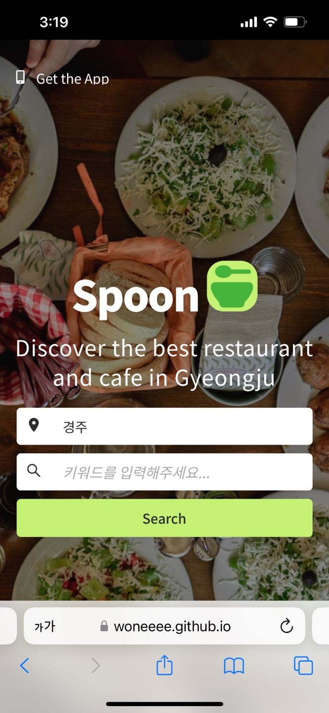
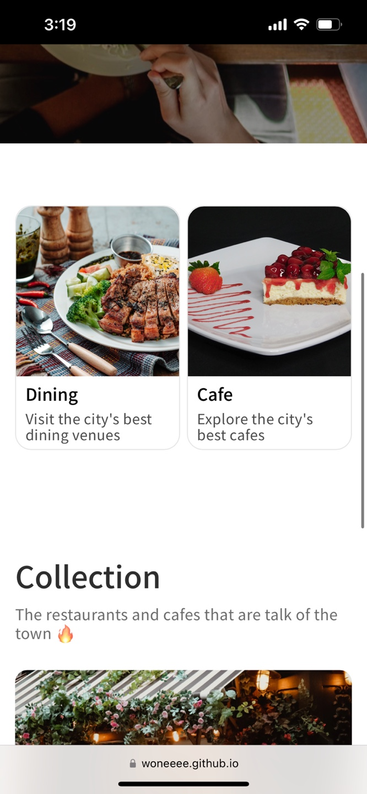
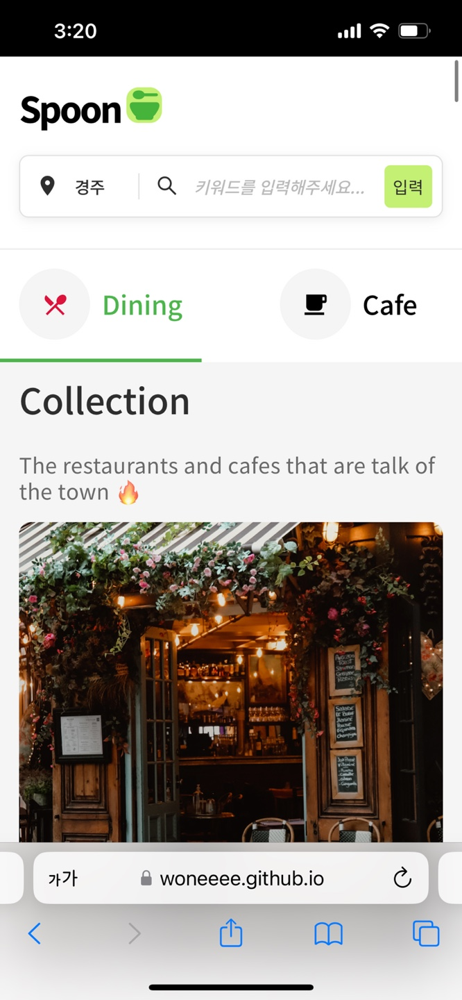
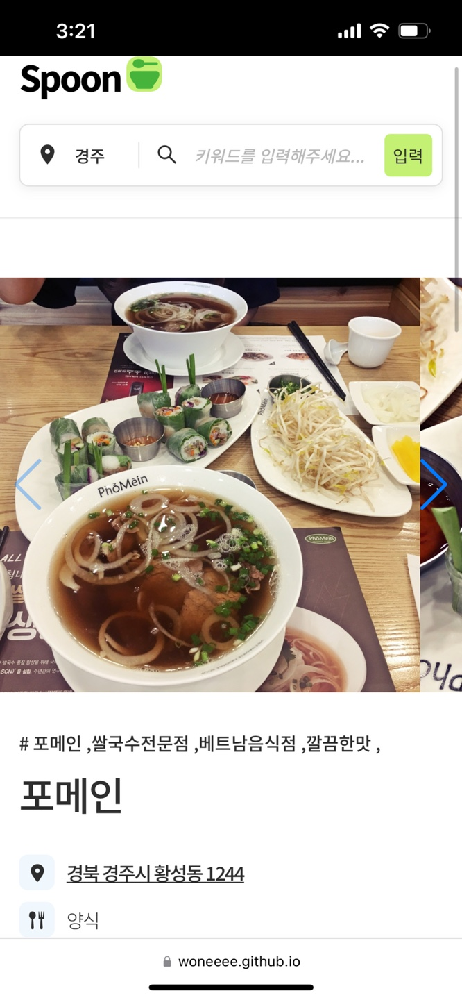
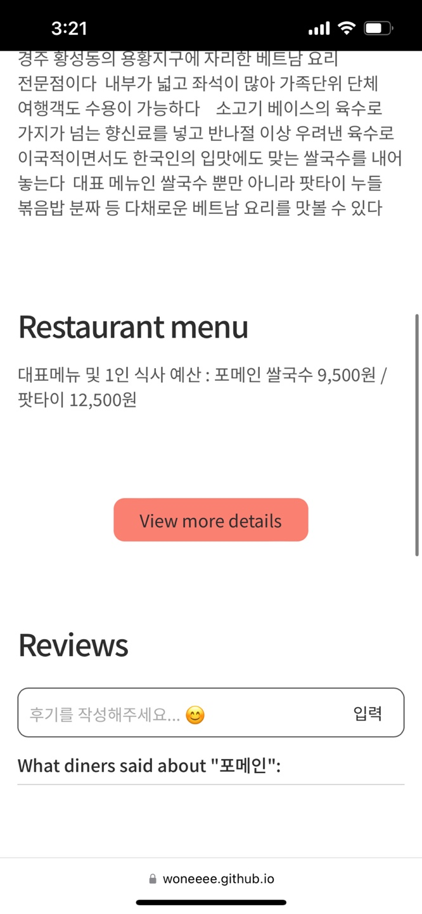
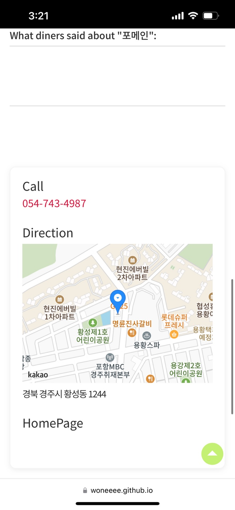

# 🥄Spoon | Fine Restaurant Finder App

## 목적성

- 경주의 맛있는 레스토랑 및 카페를 찾아주는 Fine Restaurant Finder App 입니다.
- 이 앱에서는 유저가 원하는 레스트랑 이름 또는 먹고싶은 요리를 검색하여 그에 해당하는 레스토랑의 정보를 볼 수 있습니다.
- 레스토랑 상세 페이지에서는 업체의 각종 세부적인 특징과 함께 식당에 대한 리뷰를 작성할 수 있는 영역이 존재합니다. 또한 근처 레스토랑을 추천해주며 사용자에게 더 많은 선택의 기회를 제공합니다.
- native app으로서 유저가 정보를 찾는 동시에 활동을 할 수 있게 만들고 재미있는 UI 를 구현하여 ‘Spoon’ 이라는 맛집 탐색 어플을 만들고자 합니다.

## Stack

- React
- html / css
- JS
- node.js
- git / github

## 개발 기간

- 2024.8.4~ 2024.8.15

## 계획표

| 제목      | 내용                   |
| --------- | ---------------------- |
| 8/4, 5, 6 | 레퍼런스찾기, api 찾기 |
| 8/7       | 전체적인 컴포넌트 구성 |
| 8/8       | 헤더, 푸터, 검색 구성  |
| 8/9       | 홈 구성                |
| 8/10      | 다이닝, 카페 구성      |
| 8/11      | 콜렉션 구성            |
| 8/12      | 디테일 구성            |
| 8/13      | 검색기능 구성          |
| 8/14      | 로그인, 회원가입       |
| 8/15      | 유지보수 및 배포       |

## 프로젝트 소개

- Github Url - https://github.com/Woneeee/Spoon
- Project Url - https://woneeee.github.io/Spoon/#

- 공공데이터 Open Api Url
  - https://www.data.go.kr/data/15114461/openapi.do
  - https://www.data.go.kr/data/15114465/openapi.do
  - https://www.data.go.kr/data/15114467/openapi.do
- 카카오맵 Api Url
  - https://apis.map.kakao.com/

  
  
  
  
  
  

